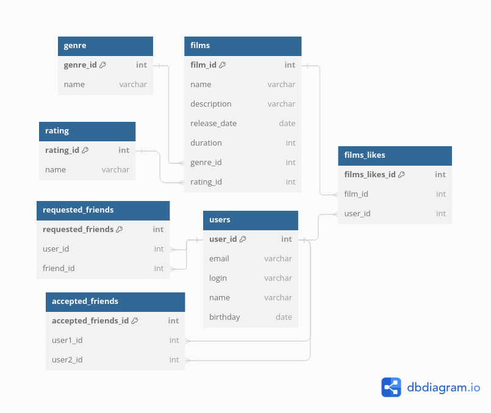

# JAVA-FILMORATE
Бэкенд для сервиса, который будет работать с фильмами и оценками пользователей, а также возвращать топ-5 фильмов, рекомендованных к просмотру.

## БД Структура:

## Описание БД:
Хранение фильмов организовано четырьмя таблицами:

**films**  
Содержит основную информацию о фильмах.  
Таблица включает такие поля:

  * первичный ключ film_id — идентификатор фильма; 
  * name — название фильма; 
  * description — описание фильма; 
  * release_date — дата выхода фильма.
  * duration — продолжительность фильма (храниться в минутах)
  * внешний ключ genre_id (ссылается на таблицу genre) — идентификатор жанра.
  * внешний ключ rating_id (ссылается на таблицу rating) — идентификатор рейтинга.

**genre**  
Содержит список возможных жанров фильмов.  
Таблица включает такие поля:

* первичный ключ genre_id — идентификатор жанра;
* name — наименование жанра;

**rating**  
Содержит список возможных рейтингов фильмов.  
Таблица включает такие поля:

* первичный ключ rating — идентификатор рейтинга;
* name — наименование рейтинга;

**films_likes**  
Аккумулирует список идентификаторов фильмов и идентификаторов пользователей поставивших данному фильму лайк.  
Таблица включает только составной ключ:

* первичный ключ film_id (ссылается на таблицу films) — идентификатор фильма.
* первичный ключ user_id (ссылается на таблицу users) — идентификатор пользователя.

Хранение пользователей организовано тремя таблицами:  

**films**  
Содержит основную информацию о пользователе.  
Таблица включает такие поля:

* первичный ключ user_id — идентификатор пользователя;
* email — адрес электронной почты;
* login — логин пользователя;
* name — Имя пользователя.
* birthday — дата рождения пользователя

При этом хранение перечня друзей организовано двумя таблицами - запросы и подтвержденные друзья

**requested_friends**  
Аккумулирует список пар идентификаторов пользователей в котором один отправил приглашение в друзья другому.  
Таблица включает только составной ключ:

* первичный ключ user_id (ссылается на таблицу users) — идентификатор пользователя который отправил запрос на дружбу.
* первичный ключ friend_id (ссылается на таблицу users) — идентификатор пользователя кому направлен запрос на дружбу.

**accepted_friends**  
Аккумулирует список пар идентификаторов пользователей которые являются друзьями.  
Таблица включает только составной ключ:

* первичный ключ user1_id (ссылается на таблицу users) — идентификатор первого пользователя.
* первичный ключ user2_id (ссылается на таблицу users) — идентификатор второго пользователя.

